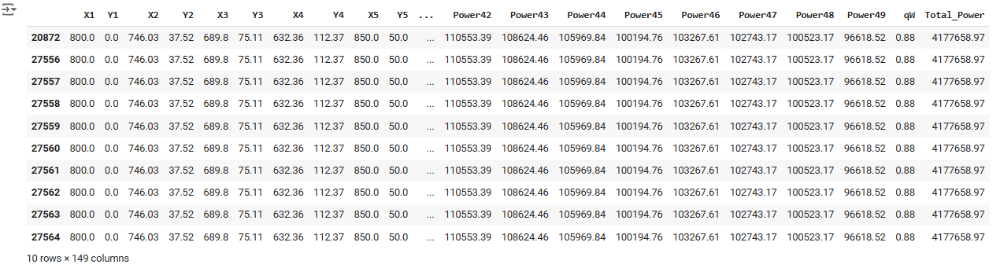
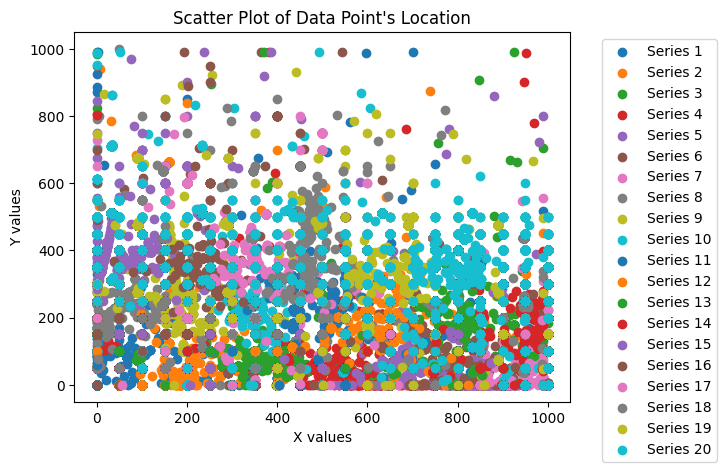

### Overview of Regression Project - DRAFT
================
#### Paula McCree-Bailey

The main goal of Project 3 is to get experience working with a regression problem. The goal is to create a blog that includes (1) an introduction to topic and dataset. Next, (2) discuss what regression is and how it works (specifically linear regression). Math for bonus points. Then, (3) discuss experiments with different types of regression. Lastly, (4) conclude with what you have learned from this project.

### **Introduction**

Fossil fuel can be a double-edged sword offering both positive and negative opportunities.  It can offer wealth to countries to fuel their economies and gasoline (plus byproducts) to offer mobility and comfort in the form of electricity for their citizens.  On the other hand, fossil fuel can be devastating to the environment if it is extracted incorrectly, and it is not an infinite resource.

A promising renewable energy resource is the use of wave farms to create energy.  The ocean covers 70% of the earth's surface.  It is also about 97% of all water on Earth.  The abundance of the oceans is a major reason to explore wave farming as an option for energy.

My project is based on the white paper [Optimisation of Large Wave Farms Using A Multi-Strategy Evolutionary Framework](https://drive.google.com/file/d/1WPVM3WzIP5SFv4GOJZVT6KZOgOme0ALp/view?usp=drive_link). The primary goal of their "research is to maximise the total harnessed power of a large wave farm consisting of fully submerged three-tether wave energy converters (WECs)." Specifically, the study looked at wave farms in Perth and Sydney, Australia which contained over twenty convertors. The research included six modern algorithms, four discrete search techniques and three hybrid optimization methods.

This regression project focuses on research on the Perth 49 converter wave farm.

##### **Perth Wave Power Project**
Perth Wave Power Project is an offshore development in Western Australia that went live in February 2015. At that time, the energy generated was able to power 3,500 households.  It is expected to reduce greenhouse gas emission by more than 500,000t over the life of the project.

The wave converters use large buoys tied to the sea floor by a rope.  As the buoy rises and falls with each passing wave, the rope tightens causes high pressures.  These pressures are piped to shore where it powers water desalination plants and produces electricity.

The goal is to predict the total power output based on the coordination of the wave energy converters (WECs) within a large wave farm.  By demonstrating the benefits of wave energy maybe we can change a few minds to invest in wave energy.


### **DataSet**

The data set was donated on 09/16/2023 to UC Irvine Machine Learning Repository. It includes 4 CSV files for wave energy converters farms based in Perth and Sydney, Australia.  Each city contains two files, one containing information on 49 wave energy converters (buoys) and another containing 100 wave energy converters. The total project contains 63,600 observations and 149 features.

The Perth Wave 49 dataset was used for this project.  It contains 36,044 observations and 149 features.

Each instance or observation represents the location of WECs in the wave farm plus the total power output and individual power of each converter and q-factor.

The features are :
*   $X_1,...,X_n$ are the X coordinates for the location of the $X_i$ buoy.
*   $Y_1,...,Y_n$ are the corresponding Y coordinates for the location of the $X_i$ buoy.
*   $Power_1,...,Power_n$ is the Power generated by the buoy $X_i Y_i$.
*   qW is the q-factor is calculated as the ratio of the power generated by the entire wave farm to the sum of power outputs from all WECs if they operate in isolation but not in a farm. generated by the buoy $X_i Y_i$. This feature was not clearly defined on the website.

 A values qW > 1 indicates this particular farm benefits from the constructive interaction between WECs, and more
energy can be generated if these WECs operate together.

*   Total Power is the total power generated by the buoys during the observational period.

[Large-scale Wave Energy Farm](https://archive.ics.uci.edu/dataset/882/large-scale+wave+energy+farm)

### **What is regression and how does it work?**

 Linear regression finds the best relationship using a straight line between independent and dependent variable. this best fit line predicts the value of the dependent  based on the independent variables and minimizes the differences between the predicted and actual.

 One common method for finding the "best-fit" line is the use of ordinary least squares method.
1.   Calculate the Total Sum of Squares (SST) which is the difference between the mean value and the actual value squared and summed.
2.   ADD detailed steps
3.   ADD detailed steps

### **Data understanding**
Rather than trying to visualize 149*49 = 7,301 data plot on a scatterplot.  The decsion was made to view the points with the highest Total_Power.   These observation would capture the best interacation between X1, Y1, ..., X49, and Y49.  After applying the code, I was surprised to see that the top 10 observations with the best Total_Power seem to be duplications.
```
TopPower = wave_df.nlargest(10,'Total_Power')
TopPower
```

By removing the duplicate observations, it reduced our data set from 36,044 to 10,936 observations. Initially, I was concerned about the duplications, but it made sense. The wave converter is floating in the ocean and unless there is a storm, a change in the location of the converter or in the current, we should expect there to be limited changes

Now, let’s look at the Total_Power for the top twenty observations (X1, Y2, … ,X49, and Y49) or first 980 data points. From this small sample, in general, the converters in locations between (X: 0 - 1000) and (Y: 0 - 300) as a collective produced the greatest amount of energy.


### **Experiment 1: Pre-processing**

From the initial data understanding, there is no null or missing values.  Also, confirmed those results with python code `wave_dups.isna().sum()` and `wave_dups.describe()` which was used above.

### Experiment 1:Modeling  --To BE COMPLETED
Create a linear regression model for your first experiment.

Documentation: https://scikit-learn.org/stable/modules/generated/sklearn.linear_model.LinearRegression.htmlLinks to an external site.
```
# Split data into training and testing sets
X_train, X_test, y_train, y_test = train_test_split(X, y, test_size=0.2, random_state=21)

# Initialize and train the model
model = LinearRegression()
model.fit(X_train, y_train)

# Make predictions
y_pred = model.predict(X_test)

# Evaluate the model
mse = mean_squared_error(y_test, y_pred)
print(f'Mean Squared Error: {mse}')

rmse = root_mean_squared_error(y_test, y_pred)
print(f'Root Mean Squared Error:  {rmse}')
```
### Experiment 2  --To BE COMPLETED 

### Experiment 3 --To BE COMPLETED

### Impact Section --To BE COMPLETED

### Conclusion --To BE COMPLETED

### References

*   [Optimisation of large wave farms using a multi-strategy evolutionary framework](https://www.semanticscholar.org/paper/153a3eeff91e73eb45338719579a900972f7a9ca)
* Neshat, Mehdi, Bradley Alexander, Nataliia Y. Sergiienko, and Markus Wagner. "Optimisation of large wave farms using a multi-strategy evolutionary framework." In Proceedings of the 2020 Genetic and Evolutionary Computation Conference, pp. 1150-1158. 2020.
*   https://education.nationalgeographic.org/resource/all-about-the-ocean/


*   https://www.power-technology.com/projects/perth-wave-energy-project/
*   https://createdigital.org.au/wave-energy-landscape/

*   https://www.abc.net.au/news/2022-07-31/wave-power-generator-supplying-king-island-with-electricity/101282070
* https://www.abc.net.au/listen/programs/scienceshow/perth-wave-energy-project-producing-power-and-fresh-water/6507450
* https://medium.com/@ingaleashay/loading-and-displaying-images-in-google-colab-a-guide-with-opencv-pil-and-matplotlib-d13bf5b8fe6b
* https://www.geeksforgeeks.org/how-to-place-legend-outside-of-the-plot-in-matplotlib/


